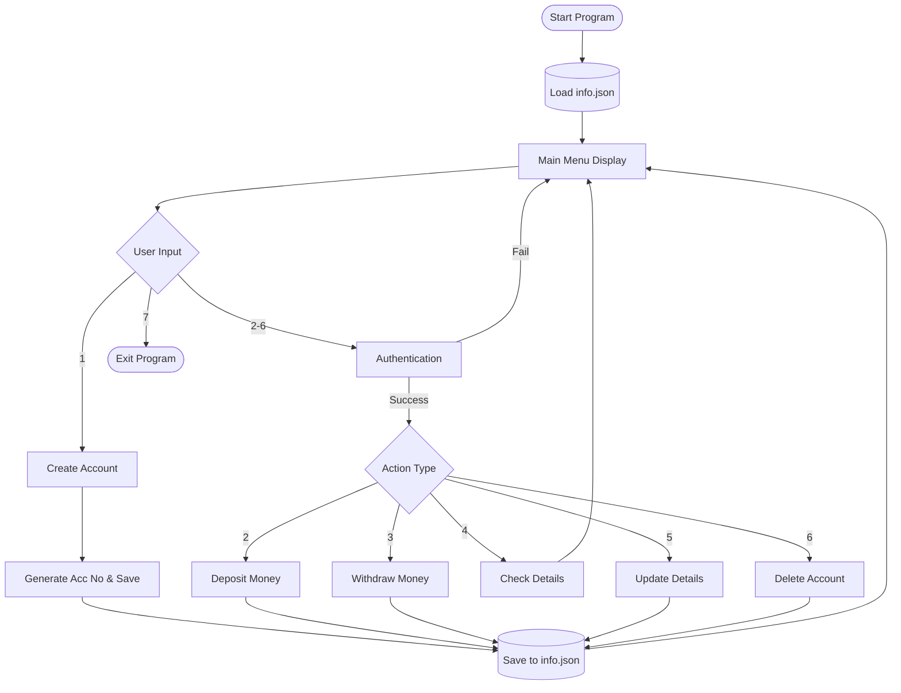

#  Bank Management System (BMS)

Welcome to the **Bank Management System (BMS)**! This is a lightweight, command-line-based Python application that simulates basic banking operations. It allows users to create accounts, perform transactions, manage their details, and persists all data locally using JSON.

---

## ✨ Features

- **Account Creation**: Sign up with your details to receive a unique 6-digit Account Number.
- **Secure Authentication**: PIN and Account Number verification required for all sensitive actions.
- **Deposit & Withdraw**: Manage your balance with real-time updates.
- **Check Details**: View your current balance and account profile.
- **Update Profile**: Modify your name, age, email, or PIN at any time.
- **Account Deletion**: Permanently remove your account and data.
- **Data Persistence**: All information is safely stored and retrieved from a local `info.json` file.

---

## How to Run

### Prerequisites
- Python 3.x installed on your system.

### Steps
1. Open your terminal or command prompt.
2. Navigate to the project directory:
   ```bash
   cd path/to/BMS
   ```
3. Run the main script:
   ```bash
   python main.py
   ```
4. Follow the interactive on-screen menu to perform banking operations!

---

##  How It Works (System Architecture)

The system revolves around the `Bank` class, which manages state and file I/O operations. When the application starts, it attempts to load existing user data from `info.json`. Any updates during the session (like depositing money) will instantly trigger an overwrite to the JSON file to keep data synchronized.

### Application Flow

Here is a visual representation of how the CLI interacts with the user and the local JSON database:



---

##  Project Structure

```text
BMS/
│
├── main.py       # Core application logic and CLI loop
├── info.json     # Local database storing all account information
└── README.md     # Project documentation
```

###  Database Schema (`info.json`)

Data is stored as a list of dictionary objects. Each account follows this schema:

```json
[
    {
        "name": "John Doe",
        "age": 25,
        "email": "johndoe@email.com",
        "pin": 1234,
        "accountNo.": 482910,
        "balance": 1500.0
    }
]
```

---

##  Built With

- **Python**: Core programming language.
- **JSON**: Used for local data serialization and persistence.
- **Random Module**: Used to generate unique 6-digit account numbers.
